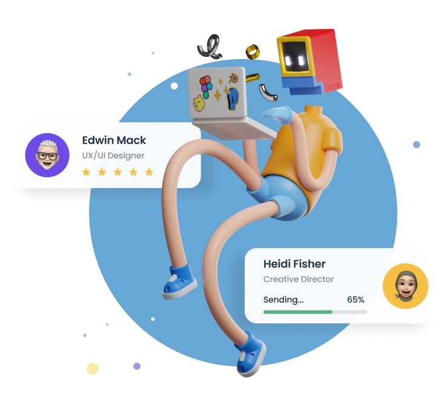

# 🌐 Simple Homepage - Alarado

Uma **landing page responsiva e moderna**, desenvolvida com **HTML, CSS e JavaScript puro**, inspirada no desafio ["Simple Homepage"](https://devchallenges.io/challenges) da DevChallenges.io.

O projeto foca em **acessibilidade, design responsivo** e **tema dinâmico (claro/escuro)** com armazenamento no `localStorage`.

---

## ✨ Demonstração

🖥️ [Acesse o site aqui](https://simple-homempage.vercel.app/) _(ou substitua pelo link do seu deploy)_



---

## 🚀 Tecnologias Utilizadas

- **HTML5** – Estrutura semântica e acessível.
- **CSS3** – Layout responsivo com media queries e uso de `clamp()` e `dvw`.
- **JavaScript Vanilla (puro)** – Interações de tema e menu.
- **Google Fonts** – Tipografia “Poppins”.
- **LocalStorage API** – Armazena a preferência de tema do usuário.

---

## 🧠 Funcionalidades Principais

✅ **Tema claro e escuro** com persistência entre sessões.  
✅ **Menu responsivo** com alternância entre versão desktop e mobile.  
✅ **Design adaptativo** para smartphones, tablets e monitores ultrawide.  
✅ **Animação de destaque** nos links ativos.  
✅ **Código organizado** e comentado para fácil manutenção.

---

## ⚙️ Estrutura do Projeto

```
📁 projeto
│
├── 📄 index.html          # Estrutura principal da página
├── 🎨 style.css           # Estilos e responsividade
├── 📁 resources/          # Imagens, ícones e favicon
└── 📄 README.md           # Documentação do projeto
```

---

## 🧩 Como Executar Localmente

1. **Clone o repositório:**

   ```bash
   git clone https://github.com/EduzzDev/Simple-Homepage.git
   ```

2. **Entre na pasta do projeto:**

   ```bash
   cd Simple-Homepage
   ```

3. **Abra o arquivo `index.html`:**
   - Clique duas vezes sobre o arquivo, ou
   - Execute com um servidor local:
     ```bash
     npx serve
     ```
     (isso abrirá no navegador em `http://localhost:3000`)

---

## 📱 Responsividade

O layout foi testado e otimizado para:

- Smartphones (a partir de **280px** de largura)
- Tablets (até **999px**)
- Desktops e telas grandes (a partir de **1000px**)

---

## 🧾 Licença

Este projeto é distribuído sob a **licença MIT**.  
Sinta-se livre para usar, modificar e compartilhar!

---

## 👨‍💻 Autor

Desenvolvido por **Eduardo Felipe**  
📧 [eduzzfelipe21@gmail.com](mailto:eduzzfelipe21@gmail.com)  
💼 [Perfil no GitHub](https://github.com/EduzzDev)  
🏆 Desafio original por [DevChallenges.io](https://www.devchallenges.io?ref=challenge)

---

> _"Design não é apenas o que se vê, mas como se sente e funciona." – Steve Jobs_
